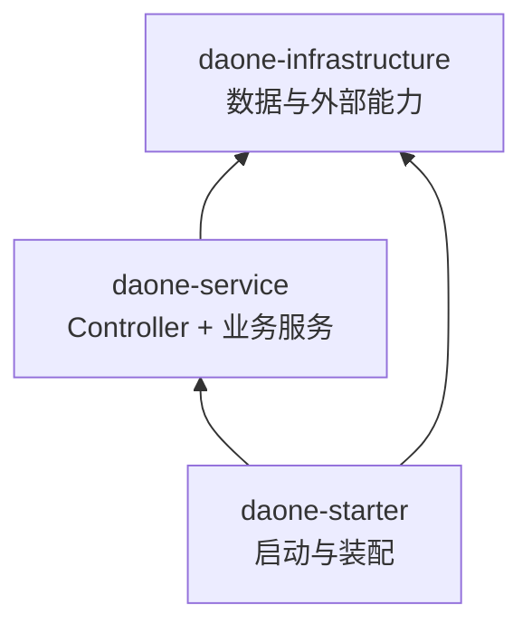
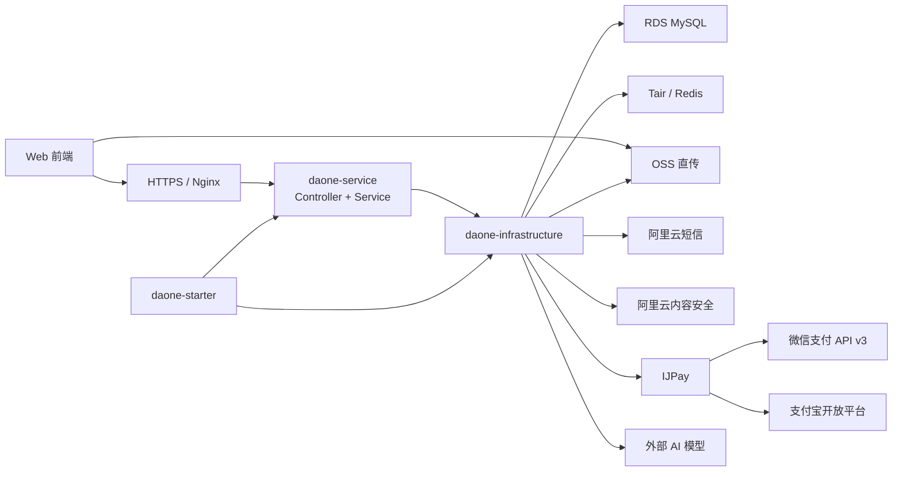
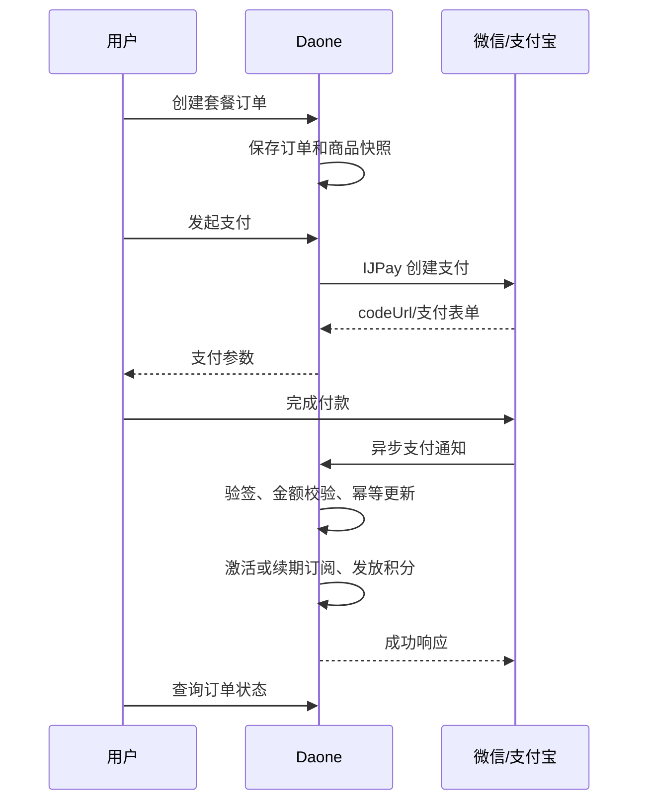

# Daone 一期后端技术方案

> 依据《Daone软件设计开发》、原《前后端接口约定》及前端原型整理。  
> 设计原则：单体应用、Maven 多模块、传统三层架构、按业务语义组织，不为一期引入领域层、微服务和复杂中间件。

## 1. 建设目标与范围

一期目标是交付一个可演示、可试点、可保存工作流的电商视觉 AI 画布。

### 1.1 一期必做

1. 微信扫码登录、手机验证码登录、退出登录。
2. 用户资料、项目、画布、画布版本。
3. 图片和视频素材上传、查询与内容安全检测。
4. 文本、图片、视频三类 AI 生成任务。
5. 工作流保存与复用。
6. 套餐、订阅、积分、微信支付、支付宝支付。
7. 基础后台：用户、套餐、订单、积分、提示词模板、模型开关。
8. 阿里云部署、日志、监控和备份。

### 1.2 一期不做

- 多人实时协作、复杂组织和 RBAC 权限。
- 微服务、注册中心、配置中心、消息队列、分布式事务和 Kubernetes。
- 自研 GPU 集群和模型训练平台。
- 海外支付、银行卡支付、银联支付。
- 支付中台、多商户和服务商模式。
- 未签约代扣产品前，不实现真正的自动续费扣款。

## 2. 技术选型

| 类别 | 选型 | 说明 |
|---|---|---|
| 构建工具 | Maven 3.9+ | 父子多模块工程 |
| Java | Java 21 LTS | 长期支持版本 |
| Web | Spring Boot 3.5.x 稳定维护版 | 单体应用 |
| 数据访问 | MyBatis-Plus | 常规 CRUD，复杂 SQL 手写 |
| 数据库 | MySQL 8.0 / 阿里云 RDS MySQL | 核心业务数据 |
| 缓存 | Redis 7 / 阿里云 Tair | 登录会话、验证码、限流 |
| 文件 | 阿里云 OSS | 用户素材、生成结果、封面 |
| 支付 | IJPay | 仅引入微信、支付宝模块 |
| 短信 | 阿里云短信 | 登录验证码 |
| 内容安全 | 阿里云内容安全 | 上传素材审核 |
| 数据库变更 | 按版本保存 SQL 脚本 | 一期不强制引入 Flyway |
| API 文档 | springdoc-openapi + Knife4j | OpenAPI 3、中文调试界面 |
| 任务调度 | Spring Scheduling | AI 任务轮询、订阅过期处理 |
| 监控日志 | Actuator + SLS | 健康检查、日志与告警 |

一期不使用 Spring Cloud、Nacos、Kafka、RocketMQ、Elasticsearch。它们对当前单体试点业务没有必要。

## 3. Maven 工程结构

一期采用传统三层思路，只保留以下三个模块，不抽象独立 Domain 层：

```text
daone/
├── pom.xml
├── daone-infrastructure/
│   └── pom.xml
├── daone-service/
│   └── pom.xml
└── daone-starter/
    └── pom.xml
```

### 3.1 模块职责

| 模块 | 职责 | 约束 |
|---|---|---|
| `daone-infrastructure` | DO、Mapper、数据库访问、Redis、OSS、短信、支付、内容安全和模型调用 | 不允许存在 Controller，不编排完整业务流程 |
| `daone-service` | Controller、Request/Response/VO、业务 Service、事务、业务校验和对象转换 | 唯一对外暴露 HTTP 接口的模块 |
| `daone-starter` | Spring Boot 启动、配置扫描、运行环境配置和定时任务开关 | 不放 Controller 和业务 Service |

不抽象领域模型、Repository Port 或 Gateway Port。Service 可以直接注入 Infrastructure 提供的 Mapper 和第三方 Client，保持传统三层架构简单清晰。

### 3.2 Maven 依赖方向



- `daone-infrastructure` 不依赖 Service。
- `daone-service` 依赖 Infrastructure。
- `daone-starter` 聚合 Service 和 Infrastructure。
- 最终只部署 `daone-starter` 生成的可执行 JAR。

父 `pom.xml`：

```xml
<modules>
    <module>daone-infrastructure</module>
    <module>daone-service</module>
    <module>daone-starter</module>
</modules>
```

### 3.3 Maven 依赖内容

| 模块 | 主要依赖 |
|---|---|
| `daone-infrastructure` | MyBatis-Plus、MySQL Driver、Redis、OSS、短信、IJPay、外部模型 HTTP SDK |
| `daone-service` | `daone-infrastructure`、Spring Web、Validation、Spring Transaction、springdoc、Knife4j |
| `daone-starter` | `daone-service`、`daone-infrastructure`、Spring Boot Starter、Actuator |

只有 Starter 配置 Spring Boot Maven Plugin，其他模块生成普通 JAR。

## 4. Package 设计

根包统一使用 `com.daone`。按照业务语义划分包，但每个业务只保留传统的 Controller、Service、DTO 等必要目录。

一期业务包控制为五个：

| 业务包 | 包含功能 |
|---|---|
| `auth` | 微信扫码、短信验证码、登录会话、退出 |
| `user` | 用户资料、账号状态 |
| `creation` | 项目、画布、素材、工作流、生成任务、AI 对话 |
| `billing` | 套餐、订阅、订单、支付、积分 |
| `operation` | 提示词模板、模型配置、首页灵感、后台运营 |

### 4.1 `daone-service`

```text
com.daone.service
├── auth
│   ├── controller
│   ├── service
│   └── dto
├── user
│   ├── controller
│   ├── service
│   └── dto
├── creation
│   ├── controller
│   ├── service
│   └── dto
├── billing
│   ├── controller
│   ├── service
│   └── dto
├── operation
│   ├── controller
│   ├── service
│   └── dto
└── common
    ├── exception
    ├── response
    ├── security
    └── converter
```

- `controller`：暴露 HTTP 接口、参数校验、获取当前用户、调用 Service。
- `service`：业务流程、事务边界和业务校验。
- `dto`：Request、Response、VO 及内部查询参数。
- `common`：统一响应、异常、登录拦截和少量公共转换。

一个业务功能初期只需一个 Service 时不再拆 interface/impl。出现多实现或确有测试替换需求后再引入接口。

### 4.2 `daone-infrastructure`

```text
com.daone.infrastructure
├── auth
│   ├── mapper
│   ├── dataobject
│   └── client
├── user
│   ├── mapper
│   └── dataobject
├── creation
│   ├── mapper
│   ├── dataobject
│   └── client
├── billing
│   ├── mapper
│   ├── dataobject
│   └── client
├── operation
│   ├── mapper
│   └── dataobject
└── common
    ├── config
    └── persistence
```

- `mapper`：MyBatis-Plus Mapper 和复杂 SQL。
- `dataobject`：数据库表映射对象，统一以 `DO` 结尾。
- `client`：Redis、OSS、短信、IJPay、内容安全和 AI 模型的轻量封装。
- `common`：MyBatis、Redis、HTTP Client 等基础配置。
- Infrastructure 中不允许出现 Controller。

### 4.3 `daone-starter`

```text
com.daone.starter
├── DaoneApplication.java
├── config
│   ├── ApplicationConfig.java
│   ├── WebConfig.java
│   ├── MybatisConfig.java
│   └── TaskConfig.java
└── support
    └── ApplicationStartupListener.java
```

由于启动类位于 `com.daone.starter`，默认扫描不到同级的 `com.daone.service` 和 `com.daone.infrastructure`，启动类需显式配置：

```java
@SpringBootApplication(scanBasePackages = "com.daone")
@MapperScan({
    "com.daone.infrastructure.auth.mapper",
    "com.daone.infrastructure.user.mapper",
    "com.daone.infrastructure.creation.mapper",
    "com.daone.infrastructure.billing.mapper",
    "com.daone.infrastructure.operation.mapper"
})
public class DaoneApplication {
}
```

### 4.4 对象流转

```text
HTTP Request
  -> Request DTO
  -> Controller
  -> Business Service
  -> Mapper / Infrastructure Client
  -> DO 或第三方响应
  -> Response DTO / VO
```

Controller 不直接调用 Mapper；DO 不直接返回前端。简单字段转换由 Service 完成，多个场景复用时才创建 Converter。

## 5. Flyway 说明与选择

Flyway 是数据库结构版本管理工具。它会按照文件名顺序执行 SQL，例如：

```text
V1__init.sql
V2__add_payment_transaction.sql
V3__add_asset_favorite.sql
```

它主要解决多人开发时“谁执行过哪份建表或变更 SQL”的问题，并在测试、预发、生产环境保持表结构一致。

Flyway 不是必须组件。一期建议：

- 先不引入 Flyway 依赖。
- 在仓库建立 `docs/sql`，按版本保存完整 SQL。
- 每次发布在发布单中明确要执行的 SQL 和回滚 SQL。
- 当后端开发人数增加、环境达到三个以上或频繁发布时，再引入 Flyway。

## 6. 总体架构



## 7. 登录设计

登录只满足原接口约定，不扩展账号中心、Refresh Token、设备管理等能力。

### 7.1 接口范围

1. 获取微信登录二维码。
2. 发送短信验证码。
3. 手机验证码登录。
4. 轮询微信扫码结果。
5. 退出登录。

### 7.2 实现方式

- 短信验证码、微信扫码状态和登录 token 均保存在 Redis。
- 登录 token 使用随机字符串，默认 7 天有效。
- 前端通过 `Authorization: Bearer <token>` 传递登录状态。
- 验证码 5 分钟有效，同一手机号 60 秒内不可重复发送。
- 微信二维码内部使用随机 `qrCodeId` 标识，避免直接使用完整 URL 作为 Redis key。
- 微信扫码确认后创建或查询用户，并返回 token。
- 退出登录删除 Redis token。

数据库 `user` 表只保存手机号、微信标识和基础资料，不建设单独的账号绑定表。

## 8. 创作业务设计

### 8.1 项目和画布

- `project` 保存项目标题、封面和用户归属。
- `project_canvas` 保存当前画布 JSON。
- `project_version` 只保存用户手动版本；自动保存不创建版本。
- 画布中的节点、连线、位置和视口由前端作为完整 JSON 提交，后端不拆表。
- 使用 `revision` 乐观锁，防止旧页面覆盖新画布。
- 单画布 JSON 首期限 2 MB。

### 8.2 素材

采用 OSS 前端直传：

1. 前端向后端申请临时上传凭证。
2. 前端直接上传 OSS。
3. 前端通知后端上传完成。
4. 后端验证 OSS 对象并创建 `asset`。
5. 发起内容安全审核，审核通过后才可用于生成。

OSS bucket 设置为私有，预览和下载使用短时签名 URL。

### 8.3 AI 生成任务

文本、图片和视频统一为 `generation_task`：

```text
QUEUED -> RUNNING -> SUCCEEDED
                  -> FAILED
                  -> CANCELED
```

提交任务时冻结积分；成功后实际扣减，失败后退回。首期使用数据库任务表和 Spring 定时任务轮询外部模型，不引入消息队列。

模型调用封装为 `daone-infrastructure.creation.client.ModelClient`，Service 直接调用该 Client，不额外抽象 Gateway。

### 8.4 AI 对话

前端编辑器右侧已经包含新建对话、历史记录、技能选择、模型选择和附件上传。一期采用最小实现：

- 保存对话会话和消息，支持刷新后恢复。
- 用户消息可以附带已有素材 ID。
- 技能和模型来自后台启用配置。
- 对话触发图片或视频生成时，仍创建统一的 `generation_task`。
- 不实现复杂 Agent 编排、长期记忆和多智能体。

### 8.5 与前端原型对应

| 原型功能 | 后端支持 |
|---|---|
| 最近项目、项目切换、已保存状态 | 项目列表、详情、画布保存 |
| 智能推荐、素材中心、我的素材 | 素材按范围和类型筛选 |
| 我的收藏 | 素材收藏关系 |
| 我的文件 | 上传素材与生成结果统一查询 |
| 画布历史记录 | 生成任务按关键词、类型、日期查询 |
| 工作流 | 工作流保存、列表、详情、复用 |
| AI 对话历史 | 对话会话与消息 |
| 导出 | 一期下载单个素材；批量 ZIP 暂不做 |

### 8.6 原型一期收口

- 左侧“项目”当前实际展示素材中心，应改名为“素材”或补充真正的项目列表页。
- 编辑资料中的密码字段应删除；当前只有微信和短信登录。
- 手机号一期不允许直接编辑，避免绕过短信校验。
- 消息通知、开票和申请试用未进入一期 PRD，前端先隐藏或置灰。
- “充值”当前打开会员套餐，如果没有独立积分商品，应改为“升级套餐”。
- 套餐中的团队协作、无限并发等文案不能先于实际能力上线。
- 画布导出一期只下载生成素材，不做服务端批量打包。

## 9. 支付模块

### 9.1 方案选择

采用 [IJPay](https://github.com/Javen205/IJPay) 作为支付 SDK 适配层：

- 支持微信支付 API v3 和支付宝。
- 不依赖特定 MVC 框架，可嵌入现有 Spring Boot 应用。
- 微信和支付宝可分别按 Maven 模块引入。
- 只作为 SDK 使用，不部署独立支付系统。

不选择 Jeepay。Jeepay 更适合多商户、服务商模式和支付中台，需要独立后台、MQ 及额外运维，与 Daone 一期单商户收款场景不匹配。

仅引入所需模块，不使用包含全部渠道的 `IJPay-All`：

```xml
<dependency>
    <groupId>com.github.javen205</groupId>
    <artifactId>IJPay-WxPay</artifactId>
    <version>${ijpay.version}</version>
</dependency>
<dependency>
    <groupId>com.github.javen205</groupId>
    <artifactId>IJPay-AliPay</artifactId>
    <version>${ijpay.version}</version>
</dependency>
```

版本由父 POM 锁定。上线前应使用 Maven 依赖扫描确认具体版本及传递依赖安全性。IJPay 封装接入细节，但交易结果仍必须以微信和支付宝服务端回调为准。

### 9.2 支付方式

一期仅支持：

| 渠道 | PC Web 方式 | 后端返回 |
|---|---|---|
| 微信 | Native 扫码支付 | `codeUrl`，前端生成二维码 |
| 支付宝 | 电脑网站支付 | 支付表单或跳转 URL |

Infrastructure 提供 `WechatPayClient` 和 `AlipayClient` 两个轻量封装，内部使用 IJPay。Service 根据 `payType` 调用对应 Client，不建设通用支付网关或插件体系。

### 9.3 支付流程



关键约束：

- 金额使用 `BIGINT` 分，不使用浮点数。
- 创建订单必须支持 `Idempotency-Key`。
- 一个业务订单允许多次支付尝试，但只能成功一次。
- 回调必须验签并校验商户号、订单号、金额和币种。
- 订阅激活和积分发放必须与订单支付成功处于同一数据库事务。
- 前端轮询只刷新状态，不能作为发放订阅的依据。
- 支付密钥和证书通过环境变量、挂载文件或 KMS 管理。

### 9.4 支付状态

业务订单：

```text
PENDING -> PAYING -> PAID
                  -> CLOSED
```

支付交易：

```text
CREATED -> PROCESSING -> SUCCESS
                      -> FAILED
                      -> CLOSED
```

订单与支付交易分开保存，避免用户切换支付渠道时覆盖原交易记录。

## 10. 订阅模块

### 10.1 订阅边界

“支付”和“订阅”是两个不同概念：

- 支付负责收款、回调和查单。
- 订阅负责套餐、有效期、权益和续期。

一期订阅采用预付费有效期模式：

1. 用户选择月付或年付套餐。
2. 支付成功后激活订阅。
3. 同套餐续费时从当前到期时间向后延长。
4. 升级套餐一期按新套餐直接覆盖，并从支付成功时间重新计算周期。
5. 到期后由定时任务标记为 `EXPIRED`。
6. 套餐下架只阻止新购，不影响已生效订阅。

### 10.2 自动续费说明

微信和支付宝的一次性支付不等于自动续费。真正自动扣款需要分别申请委托代扣/周期扣款产品、完成签约并保存支付协议号。

为避免一期过度设计：

- 一期 `autoRenew=false`，用户到期前主动支付续费。
- 接口可保留 `autoRenewal` 字段，但当前只返回 `false`。
- “取消自动续费”接口保持幂等，当前调用后仍返回成功。
- 取得微信或支付宝代扣资质后，再新增 `subscription_agreement` 和续费扣款任务，不提前建立空流程。

### 10.3 订阅状态

```text
ACTIVE -> EXPIRED
       -> TERMINATED
```

- `ACTIVE`：已支付且在有效期内。
- `EXPIRED`：超过到期时间。
- `TERMINATED`：管理员终止。

订阅有效性的最终判断为：

```text
status = ACTIVE and current_time < current_period_end
```

### 10.4 支付成功后的订阅处理

支付回调执行以下本地事务：

1. 按渠道通知号进行幂等校验。
2. 锁定 `payment_order`。
3. 确认订单未处理且金额一致。
4. 将 `payment_transaction` 更新为 `SUCCESS`。
5. 将 `payment_order` 更新为 `PAID`。
6. 创建或续期 `user_subscription`。
7. 根据套餐快照发放积分并写入 `point_ledger`。
8. 记录通知处理结果。

数据库事务提交失败时向支付平台返回失败，由平台重试通知。重复通知通过唯一索引和订单状态直接返回成功，不重复续期或发放积分。

## 11. 订阅与支付表结构

### 11.1 `subscription_plan`

套餐主表，不存具体月付、年付价格。

| 字段 | 类型 | 说明 |
|---|---|---|
| `id` | BIGINT | 主键 |
| `plan_code` | VARCHAR(32) | 套餐编码，唯一 |
| `plan_name` | VARCHAR(64) | 套餐名称 |
| `description` | VARCHAR(500) | 简介 |
| `benefits_json` | JSON | 展示权益 |
| `status` | VARCHAR(16) | `ENABLED`、`DISABLED` |
| `created_at` | DATETIME | 创建时间 |
| `updated_at` | DATETIME | 更新时间 |

唯一索引：`uk_plan_code(plan_code)`。

### 11.2 `subscription_plan_price`

同一套餐的不同付费周期。

| 字段 | 类型 | 说明 |
|---|---|---|
| `id` | BIGINT | 主键 |
| `plan_id` | BIGINT | 套餐 ID |
| `price_code` | VARCHAR(32) | 价格编码，唯一 |
| `cycle_unit` | VARCHAR(16) | `MONTH`、`YEAR` |
| `cycle_count` | INT | 周期数量，一期为 1 |
| `price_fen` | BIGINT | 售价，单位分 |
| `original_price_fen` | BIGINT | 划线价，可空 |
| `grant_points` | BIGINT | 支付成功发放积分 |
| `status` | VARCHAR(16) | `ENABLED`、`DISABLED` |
| `created_at` | DATETIME | 创建时间 |
| `updated_at` | DATETIME | 更新时间 |

唯一索引：`uk_price_code(price_code)`。  
普通索引：`idx_plan_status(plan_id, status)`。

### 11.3 `user_subscription`

用户当前订阅。一期一个用户最多保留一条当前订阅记录。

| 字段 | 类型 | 说明 |
|---|---|---|
| `id` | BIGINT | 主键 |
| `user_id` | BIGINT | 用户 ID |
| `plan_id` | BIGINT | 当前套餐 ID |
| `price_code` | VARCHAR(32) | 最近购买价格编码 |
| `status` | VARCHAR(16) | `ACTIVE`、`EXPIRED`、`TERMINATED` |
| `current_period_start` | DATETIME | 当前周期开始 |
| `current_period_end` | DATETIME | 当前周期结束 |
| `auto_renew` | TINYINT | 一期固定为 0 |
| `latest_order_no` | VARCHAR(40) | 最近生效订单号 |
| `version` | INT | 乐观锁 |
| `created_at` | DATETIME | 创建时间 |
| `updated_at` | DATETIME | 更新时间 |

唯一索引：`uk_subscription_user(user_id)`。  
普通索引：`idx_subscription_expire(status, current_period_end)`。

不单独建立订阅历史表。历史通过已支付订单查询，减少重复数据。

### 11.4 `payment_order`

业务订单，保存购买时的商品快照，后续套餐改价不影响历史订单。

| 字段 | 类型 | 说明 |
|---|---|---|
| `id` | BIGINT | 主键 |
| `order_no` | VARCHAR(40) | 业务订单号，唯一 |
| `user_id` | BIGINT | 用户 ID |
| `order_type` | VARCHAR(20) | `SUBSCRIPTION`、`POINT_RECHARGE` |
| `product_code` | VARCHAR(32) | `price_code` 或积分商品编码 |
| `product_name` | VARCHAR(100) | 商品名称快照 |
| `product_snapshot_json` | JSON | 周期、积分等快照 |
| `amount_fen` | BIGINT | 应付金额 |
| `currency` | CHAR(3) | 固定 `CNY` |
| `status` | VARCHAR(16) | `PENDING`、`PAYING`、`PAID`、`CLOSED` |
| `expire_at` | DATETIME | 支付过期时间 |
| `paid_at` | DATETIME | 支付时间 |
| `idempotency_key` | VARCHAR(64) | 创建订单幂等键 |
| `created_at` | DATETIME | 创建时间 |
| `updated_at` | DATETIME | 更新时间 |

唯一索引：

- `uk_order_no(order_no)`
- `uk_user_idempotency(user_id, idempotency_key)`

普通索引：`idx_order_user_time(user_id, created_at)`。

### 11.5 `payment_transaction`

支付渠道交易记录。一个订单可以先尝试微信，再尝试支付宝。

| 字段 | 类型 | 说明 |
|---|---|---|
| `id` | BIGINT | 主键 |
| `transaction_no` | VARCHAR(40) | Daone 支付流水号，唯一 |
| `order_no` | VARCHAR(40) | 业务订单号 |
| `channel` | VARCHAR(16) | `WECHAT`、`ALIPAY` |
| `channel_trade_no` | VARCHAR(64) | 渠道交易号 |
| `status` | VARCHAR(16) | `CREATED`、`PROCESSING`、`SUCCESS`、`FAILED`、`CLOSED` |
| `amount_fen` | BIGINT | 支付金额 |
| `pay_payload` | TEXT | codeUrl 或必要支付参数，敏感内容不保存 |
| `failure_code` | VARCHAR(64) | 失败码 |
| `failure_message` | VARCHAR(255) | 失败原因 |
| `paid_at` | DATETIME | 渠道支付时间 |
| `created_at` | DATETIME | 创建时间 |
| `updated_at` | DATETIME | 更新时间 |

唯一索引：

- `uk_transaction_no(transaction_no)`
- `uk_channel_trade(channel, channel_trade_no)`

普通索引：`idx_transaction_order(order_no)`。

### 11.6 `payment_notify_log`

支付回调日志，用于幂等和问题排查。

| 字段 | 类型 | 说明 |
|---|---|---|
| `id` | BIGINT | 主键 |
| `channel` | VARCHAR(16) | 支付渠道 |
| `notify_id` | VARCHAR(128) | 渠道通知唯一标识 |
| `order_no` | VARCHAR(40) | 业务订单号 |
| `transaction_no` | VARCHAR(40) | Daone 支付流水号 |
| `signature_valid` | TINYINT | 验签结果 |
| `process_status` | VARCHAR(16) | `RECEIVED`、`SUCCESS`、`FAILED` |
| `notify_body` | MEDIUMTEXT | 脱敏后的通知原文 |
| `error_message` | VARCHAR(500) | 处理错误 |
| `created_at` | DATETIME | 接收时间 |
| `processed_at` | DATETIME | 完成时间 |

唯一索引：`uk_channel_notify(channel, notify_id)`。

通知正文只用于审计和排障，应脱敏并设置保留周期，不记录密钥和证书。

### 11.7 积分表

`point_account`：

| 字段 | 类型 | 说明 |
|---|---|---|
| `user_id` | BIGINT | 用户 ID，主键 |
| `available_points` | BIGINT | 可用积分 |
| `frozen_points` | BIGINT | AI 任务冻结积分 |
| `version` | INT | 乐观锁 |
| `updated_at` | DATETIME | 更新时间 |

`point_ledger`：

| 字段 | 类型 | 说明 |
|---|---|---|
| `id` | BIGINT | 主键 |
| `user_id` | BIGINT | 用户 ID |
| `action` | VARCHAR(16) | `GRANT`、`FREEZE`、`CONSUME`、`REFUND`、`ADJUST` |
| `amount` | BIGINT | 变动值 |
| `balance_after` | BIGINT | 变动后可用余额 |
| `biz_type` | VARCHAR(32) | 订单、生成任务等 |
| `biz_id` | VARCHAR(64) | 业务 ID |
| `description` | VARCHAR(255) | 说明 |
| `created_at` | DATETIME | 创建时间 |

唯一索引：`uk_point_biz(user_id, biz_type, biz_id, action)`。

## 12. 其他核心表

| 表 | 用途 |
|---|---|
| `user` | 用户资料和登录标识 |
| `project` | 项目元数据 |
| `project_canvas` | 当前画布 JSON |
| `project_version` | 手动画布版本 |
| `asset` | 上传和生成素材 |
| `asset_favorite` | 用户素材收藏关系 |
| `workflow` | 用户工作流 |
| `generation_task` | AI 生成任务 |
| `generation_result` | AI 结果素材关联 |
| `chat_session` | AI 对话会话 |
| `chat_message` | 用户和助手消息、关联生成任务 |
| `inspiration` | 首页灵感展示内容 |
| `prompt_template` | 提示词模板 |
| `model_config` | 模型开关、参数和积分规则 |

业务 ID 使用 64 位 ID，并以字符串返回前端，避免 JavaScript 精度问题。订单号和支付流水号使用带时间前缀的业务编号，不直接暴露数据库主键。

## 13. 事务与一致性

只使用 MySQL 本地事务，不引入分布式事务。

必须处于同一事务的操作：

1. 支付成功、订阅激活、积分发放。
2. AI 任务创建、积分冻结。
3. AI 任务成功、积分扣减、结果素材创建。
4. AI 任务失败、积分解冻。

外部支付和模型调用不能包在数据库长事务中：

1. 先提交本地订单或任务。
2. 再调用外部接口。
3. 根据结果开启短事务更新状态。

支付回调、订单创建和 AI 任务创建都必须使用唯一键保证幂等。

## 14. 阿里云部署

### 14.1 一期拓扑

| 服务 | 建议配置 | 用途 |
|---|---|---|
| ECS | 2 核 4 GB，1 台 | Nginx + `daone-starter.jar` |
| RDS MySQL | 2 核 4 GB | 业务数据库 |
| Tair/Redis | 1 GB | 会话、验证码、限流 |
| OSS | 私有 bucket | 素材和生成结果 |
| CDN | 按流量开启 | 前端和静态资源加速 |
| 阿里云短信 | 验证码模板 | 手机登录 |
| 内容安全 | 图片、视频检测 | 上传风控 |
| SLS | 应用和 Nginx 日志 | 日志检索与告警 |

前端部署到 OSS 静态网站并使用 CDN；API 使用独立域名。ECS、RDS、Redis 位于同一 VPC，RDS 和 Redis 不开放公网。

### 14.2 构建和发布

构建命令：

```bash
mvn clean package -DskipTests=false
```

产物：

```text
daone-starter/target/daone-starter.jar
```

发布流程：

1. Maven 测试和构建。
2. 检查本次发布所需 SQL 脚本。
3. 上传 JAR 或构建单个 Docker 镜像。
4. ECS 发布。
5. 调用 Actuator 健康检查。
6. 失败时回滚上一版本。

一期不要求 Docker；团队已有容器发布习惯时可使用单容器。

## 15. 配置与安全

运行环境明确划分为：

- `local`：H2、内存登录态、本地文件模拟 OSS、固定短信验证码和外部能力 Mock。
- `test`：阿里云测试 RDS、Redis、OSS 等独立资源，默认关闭外部能力 Mock。
- `prod`：RDS MySQL、Tair/Redis；关闭 SQL 自动初始化、Swagger 和全部 Mock。

本地 Knife4j 地址为 `/doc.html`，Swagger UI 地址为 `/swagger-ui.html`。
测试环境默认开启文档便于联调；生产环境默认关闭，可通过环境变量临时开启。

生产环境必须配置前端地址与 CORS 白名单，不允许沿用 localhost 默认值。
完整建表脚本单独保存在 `docs/sql/daone_schema_mysql.sql`，测试和生产环境
均由发布流程显式执行，不允许应用启动时自动修改数据库。

- `application.yml` 只存非敏感默认配置。
- 数据库密码、Redis 密码、支付私钥、API v3 Key、支付宝私钥、模型密钥通过环境变量或 KMS 注入。
- 微信和支付宝回调地址只允许 HTTPS。
- OSS objectKey 由后端生成，前端不能指定其他用户目录。
- 日志不得输出验证码、token、完整手机号、支付私钥和模型密钥。
- 支付回调保存脱敏报文，不保存请求中的敏感凭据。
- 普通接口统一返回 `traceId`。

## 16. 测试重点

1. 重复支付通知不会重复续期和发放积分。
2. 用户先微信后支付宝支付时，只允许一笔交易成功生效。
3. 套餐改价后，历史订单仍使用创建时的价格和权益快照。
4. 同套餐续费从当前到期日延长，不损失剩余有效期。
5. 管理员终止订阅后，订阅状态和权益判断正确。
6. AI 任务失败或超时后积分正确退回。
7. 并发保存画布时旧 revision 不覆盖新数据。
8. 用户不能读取其他用户的项目、素材、订单和订阅。
9. 微信、支付宝回调验签失败时不更新任何业务数据。
10. 定时任务重复执行时不会重复过期订阅或重复处理 AI 任务。
11. 重复收藏素材不会产生重复记录，取消收藏保持幂等。
12. AI 对话只能访问当前用户的会话和附件素材。

## 17. 后续演进条件

只有出现明确需求时再演进：

- 业务规则明显复杂且团队确认需要时，再评估领域层；不作为当前预设演进路线。
- 获得微信/支付宝代扣资质：增加签约协议和自动续费任务。
- 单机 AI 任务调度成为瓶颈：引入 RocketMQ。
- API 需要多实例：增加 ALB 和任务抢占机制。
- 多人实时协作确定上线：单独设计 WebSocket 和冲突合并。
- 素材达到百万级且 MySQL 搜索不足：再评估 Elasticsearch。
